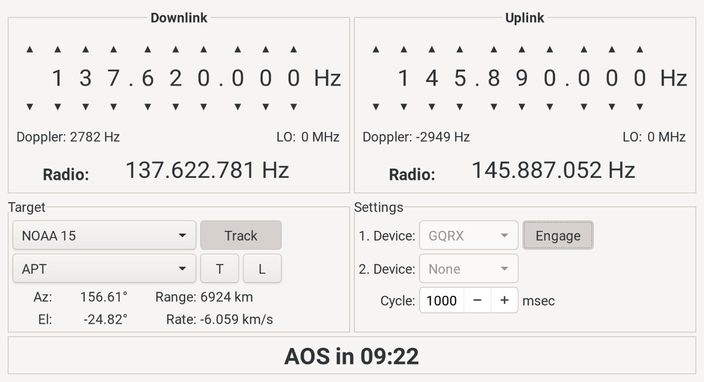
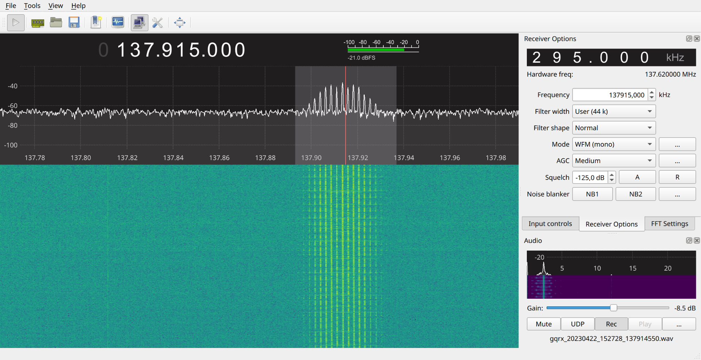
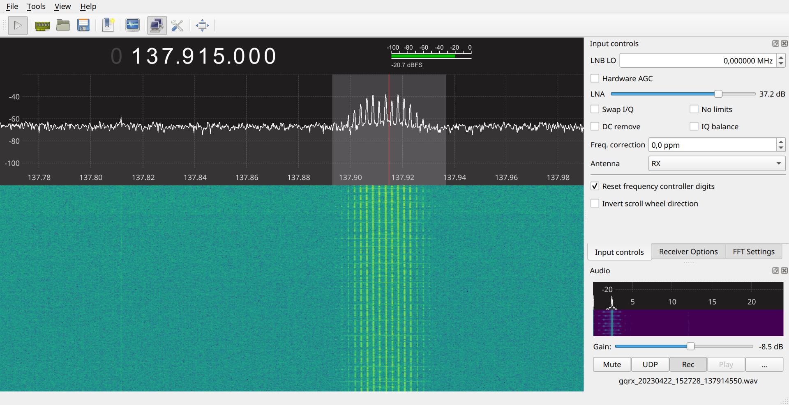

## Planification préliminaire

- [ ] S'assurer qu'il y a une bonne passe d'un satellite au dessus de Montréal
    - Une bonne passe arrive à une heure raisonnable (GPredict -> future passes)
    - Lors d'une bonne passe, le satellite a une élévation maximale de plus de 30 degrés au dessus de l'horizon
- [ ] S'assurer qu'au moment de la passe, la météo à Montréal n'est pas dégueulasse

## Préparation du hardware

### Préparation du laptop

- [ ] S'assurer que les logiciels GQRX et GPredict sont installés sur le laptop
- [ ] Charger le laptop

### Préparation de l'antenne et de la SDR

- [ ] Ajuster la longueur des deux segments d'antennes.
    - Pour les satellites NOAA qui opèrent autour de 137 MHz, la longueur des segments devrait être de 53,4 cm.
- [ ] Visser les segments de l'antenne au bloc.
- [ ] Ajuster l'angle entre les segments à 120° (ou 90 cm entre les extrémités).
- [ ] Viser les segments de cables coaxial à l'antenne et à la radio SDR
- [ ] Brancher la radio SDR dans le laptop

### Préparation d'une monture

- [ ] Visser le bloc de l'antenne au petit trépied ajustable.
- [ ] Sortir un grand trépied du local de storage.

## Préparation du software

### GPredict

- [ ] Mettre à jour les données de GPredict (TLE et transponders)
- Recommendation: c'est pratique d'avoir l'enregistrement automatique (signalling AOS et LOS cochés)

- [ ] Ouvrir la fenêtre *“Radio Control”*
    - [ ] Sélectionner le bon satellite dans la liste sous *“Target”*
    - [ ] Sélectionner le signal *“APT”* puis cliquer sur *“T”*
    - [ ] S’assurer que gpredict a automatiquement réglé la bonne fréquence dans *Downlink*
        - NOAA 15: 137.62 MHz
        - NOAA 18: 137.9125 MHz
        - NOAA 19: 137.1 MHz
    - [ ] Ouvrir gqrx si ce n'est pas déjà fait
        - Sidenote: S’assurer que contrôle de gqrx via TCP est setuppé
    - [ ] Activer *“Track”* pour lancer la correction du décalage Doppler
    - [ ] Activer *“Engage”* pour débuter l’envoi des commandes à gqrx

### gqrx

- Paramètres de démodulation *(“Receiver Options”)*
    - [ ] Frequency: *[ajustée automatiquement par gpredict]*
    - [ ] Filter width: User (45 kHz)
    - [ ] Filter shape: Sharp
    - [ ] Mode: “WFM (mono)”

 

- Paramètres de réception *(“Input Controls”)*
    - [ ] Ajuster LNA pour séparer le bruit et le signal
        - Commencer avec la valeur la plus faible, puis augmenter tant que ça améliore le signal

 

## Quoi faire dehors

### Hardware

- [ ] S'assurer que l'antenne est orientée Nord-Sud
- [ ] Ajuster la hauteur de l'antenne pour qu'elle soit haute
    - tout en évitant les hauteurs qui sont des multiples d'un mètre
- [ ] Placer le laptop aussi loin de l'antenne que possible tout en assurant que le cable coaxial n'est pas tendu

### Software

- [ ] S'assurer que le bouton record est appuyé lorsque le moment d'AOS est arrivé, sinon le faire manuellement
- [ ] S'assurer que le bouton record n'est plus appuyé une fois le LOS arrivé, sinon le faire manuellement
